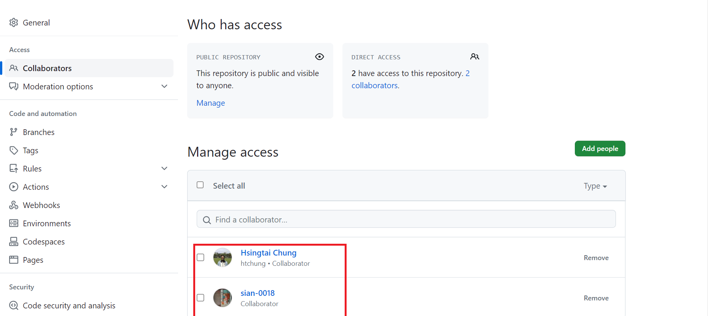
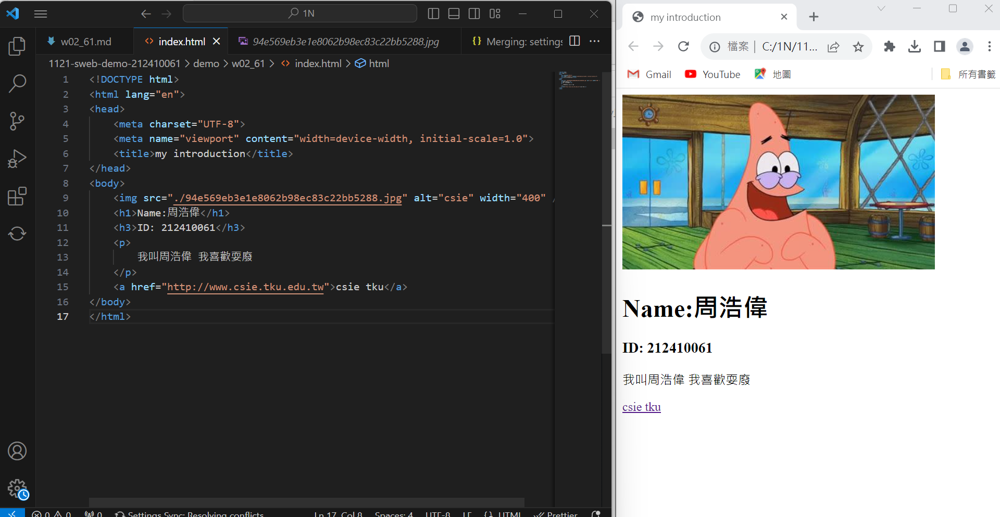
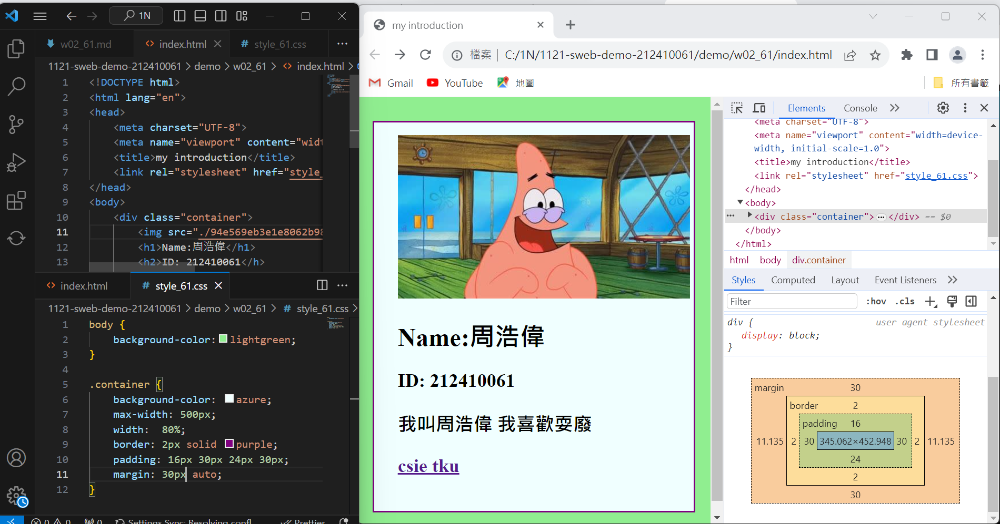
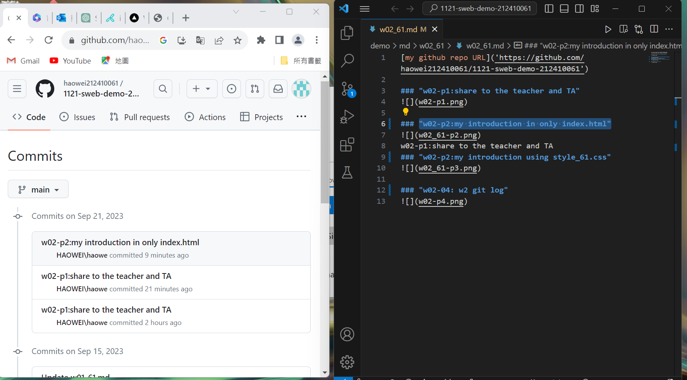

[my github repo URL]('https://github.com/Jun206/1121-sweb-demo-209410793')

### "w02-p1:share to the teacher and TA"

### "w02-p2:my introduction in only index.html"

### "w02-p2:my introduction using style_93.css"

### "w02-04: w2 git log"

